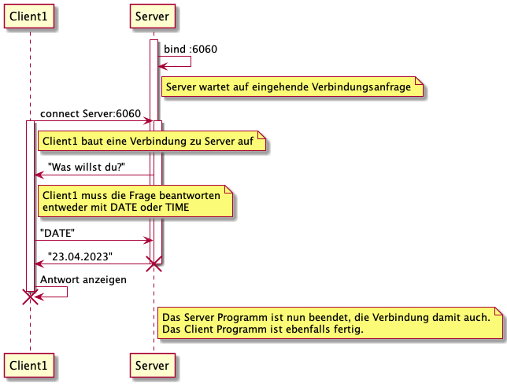

## Inhalte

|Branch|Klasse|Parallel|Endlos|Beschreibung|
|---|---|---|---|---|
|master|DateServer|-|-|Verarbeitet nur eine Verbindung und schickt direkt eine Antwort.|
|master|DateTimeServer|x|x|Verarbeitet mehrere Verbindungen parallel. Läuft endlos. Schickt eine Antwort nachdem der Client gesagt hat, was er genau will. Die Antwort beinhaltet ein mit Java serialisiertes Objekt.|
|date-time-protocol|DateServer|-|x|Verarbeitet nur eine Verbindung gleichzeitig. Läuft endlos. Schickt eine Antwort nachdem der Client gesagt hat, was er genau will.
|endless-parallel|DateServer|x|x|Verarbeitet mehrere Verbindungen parallel. Läuft endlos. Schickt eine Antwort nachdem der Client gesagt hat, was er genau will.|
|serializable|DateTimeServer|x|x|Wie DateTimeServer auf master. Zusätzlich: Verwendet XML-Serialisierung anstelle von Java Serialisierung.

### Protokoll

Abgesehen von DateServer auf dem master Branch implementieren alle Server-Varianten das gleiche Protokoll.

1. Server startet
1. Client baut Verbindung auf
1. Server fragt den Client was er genau will (Date oder Time Auskunft)
1. Client schickt Antwort auf die Frage (Date oder Time)
1. Server schickt die gewünschte Auskunft (Date oder Time)

Als Sequenzdiagramm (DateServer auf Branch date-time-protocol):

## Docker

### create container based on Dockerfile

`docker build -t datetimeserver .`

### start container, exposing port 6060 to us / the client

`docker run -d -p 6060:6060 --rm --name dtserver datetimeserver`

### stop container

you may rerun it later at any time using the `docker run` command from above. \
`docker stop dtserver`
